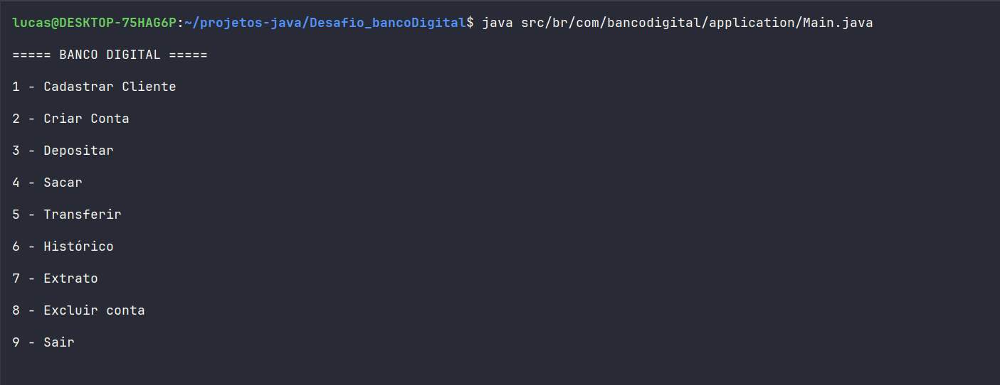

# 🏦 Banco Digital em Java

Projeto desenvolvido com foco em Programação Orientada a Objetos (POO) em Java, simulando operações básicas de um banco digital através de um sistema de terminal interativo.

<div align="center">


</div>

# 📸 Demonstração




## 🚀 Objetivos do Projeto

Este projeto foi desenvolvido com o objetivo de praticar conceitos fundamentais de Java e POO, incluindo:

- Classes e Objetos
- Encapsulamento
- Herança
- Polimorfismo
- Interfaces
- Collections Framework
- Tratamento de Exceções
- Organização de pacotes
- Separação de responsabilidades

---

# ⚙️ Tecnologias Utilizadas

- Java
- IntelliJ IDEA
- Programação Orientada a Objetos
- Collections Framework


--- 

# 📂 Estrutura do Projeto

```text
src
└── br.com.bancodigital
    ├── banco
    │   └── Banco.java
    │
    ├── exceptions
    │   └── CpfInvalidoException.java
    │
    ├── interfaces
    │   └── IConta.java
    │
    ├── models
    │   ├── Cliente.java
    │   ├── Conta.java
    │   ├── ContaCorrente.java
    │   └── ContaPoupanca.java
    │
    ├── services
    │   └── MenuService.java
    │
    └── Main.java
````

---

# 📋 Funcionalidades do Sistema

## 👤 Cadastro de Cliente

O sistema permite cadastrar clientes utilizando:

- Nome
- CPF

Foi implementada uma validação personalizada de CPF utilizando Exception customizada.

---

## 💳 Contas Bancárias

O usuário pode criar:

- Conta Corrente
- Conta Poupança

Cada conta possui:

- Agência
- Número
- Saldo
- Histórico de movimentações

---

## 💸 Operações Bancárias

### 💰 Depósito

Permite adicionar saldo à conta.

---

### 💵 Saque

Realiza validação de saldo antes da operação.

---

### 🔄 Transferência

Permite transferências entre contas.

---

### 📜 Histórico

Cada conta possui histórico individual de transações.

---

### 🧾 Extrato

O sistema exibe:

- Titular
- Agência
- Número da conta
- Saldo atual

---

# 🛡️ Tratamento de Exceções

O projeto implementa Exception personalizada:

# `CpfInvalidoException`

Utilizada para validar CPF durante o cadastro do cliente.

---


# 🧠 Conceitos de POO Aplicados

# 🔹 Abstração
A classe `Conta` foi criada como abstrata, servindo como base para os diferentes tipos de contas.

# 🔹 Herança
As classes:
- `ContaCorrente`
- `ContaPoupanca`

herdam características da classe `Conta`.

# 🔹 Polimorfismo
O sistema trabalha com referências do tipo `Conta`, permitindo manipular diferentes tipos de contas de forma genérica.

# 🔹 Encapsulamento
Os atributos das entidades foram protegidos utilizando modificadores de acesso e métodos getters/setters.

# 🔹 Interfaces
A interface `IConta` define os comportamentos obrigatórios das contas bancárias.

---


# 📐 Diagrama UML

<div align="center">
  
  ```mermaid
classDiagram

class IConta {
    <<interface>>
    +sacar(valor)
    +depositar(valor)
    +transferir(valor, destino)
}

class Conta {
    #agencia : int
    #numero : int
    -saldo : double
    #cliente : Cliente
    #historico : List<String>

    +sacar(valor)
    +depositar(valor)
    +transferir(valor, destino)
    +exibirHistorico()
    +imprimirInformacoes()
}

class ContaCorrente {
    +imprimirExtrato()
}

class ContaPoupanca {
    +imprimirExtrato()
}

class Cliente {
    -nome : String
    -cpf : String
}

class Banco {
    -contas : List<Conta>
    -clientes : List<Cliente>

    +buscarConta(numero)
    +buscarCliente(nome)
    +adicionarConta(conta)
    +adicionarCliente(cliente)
    +removerConta(conta)
}

class MenuService {
    -banco : Banco
    -sc : Scanner

    +iniciar()
    +criarConta()
    +depositar()
    +sacar()
    +transferir()
    +mostrarHistorico()
    +imprimirExtrato()
    +excluirConta()
}

class CpfInvalidoException

IConta <|.. Conta
Conta <|-- ContaCorrente
Conta <|-- ContaPoupanca

Conta --> Cliente
Banco --> Conta
Banco --> Cliente
MenuService --> Banco

CpfInvalidoException ..> Cliente
```

</div> 

# ▶️ Como Executar

# 1️⃣ Clone o repositório

```bash
git clone https://github.com/SEU-USUARIO/NOME-DO-REPOSITORIO.git
```

---

# 2️⃣ Acesse a pasta do projeto

```bash
cd NOME-DO-REPOSITORIO
```

---

# 3️⃣ Abra o projeto na IDE

Abra o projeto utilizando:

- IntelliJ IDEA
- Eclipse
- VS Code com extensão Java

---

# 4️⃣ Execute o projeto

Execute a classe:

```text
Main.java
```

---

# ✅ Requisitos

- Java 17+ (ou versão utilizada no projeto)
- IDE Java instalada


# 📌 Melhorias Futuras
Persistência em banco de dados
Login/autenticação
Interface gráfica
API REST com Spring Boot
Uso completo de LocalDateTime nas transações
Classe Transacao ao invés de List<String>
Testes unitários com JUnit
Uso de BigDecimal para operações financeiras 

# 👨‍💻 Autor

Projeto desenvolvido para fins educacionais e prática de Programação Orientada a Objetos em Java.

